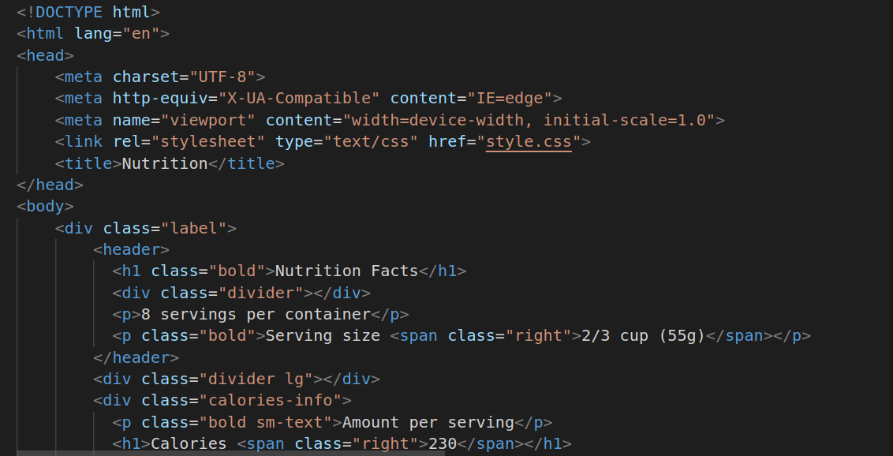
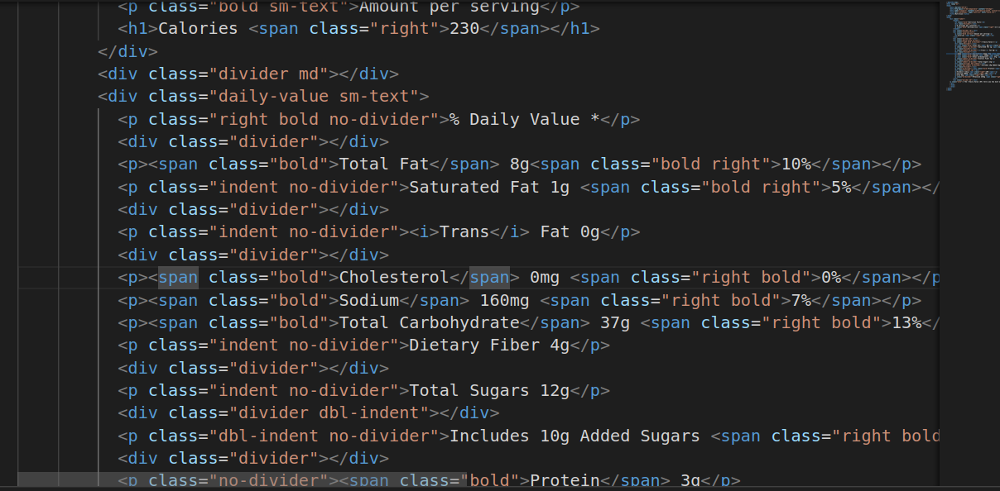
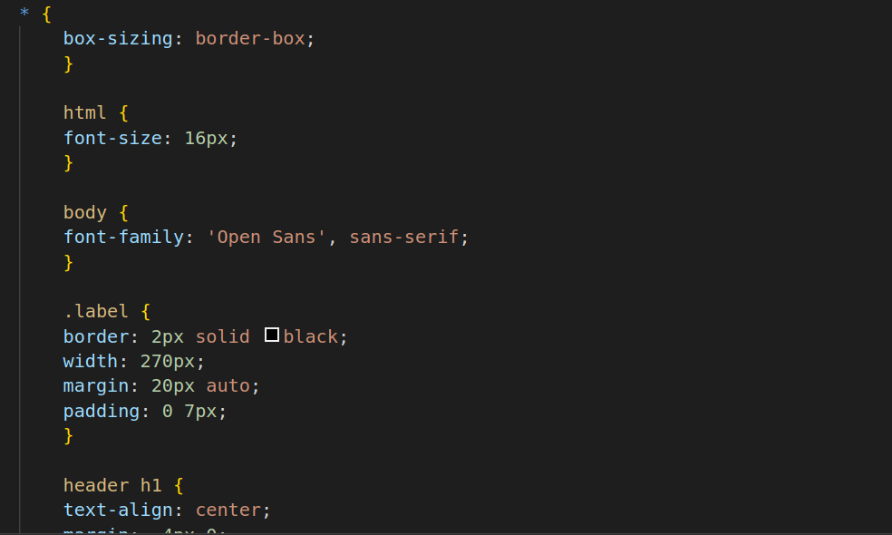
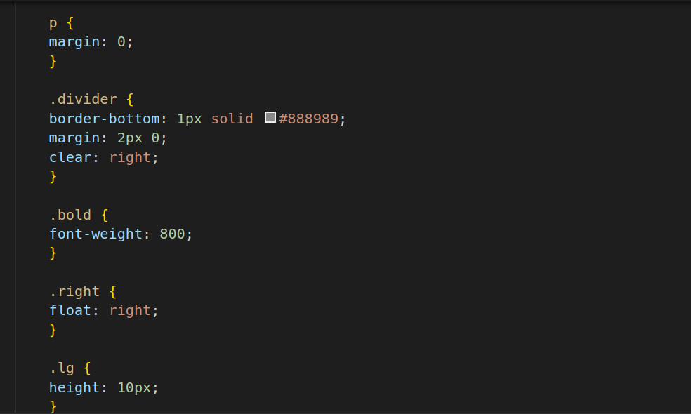
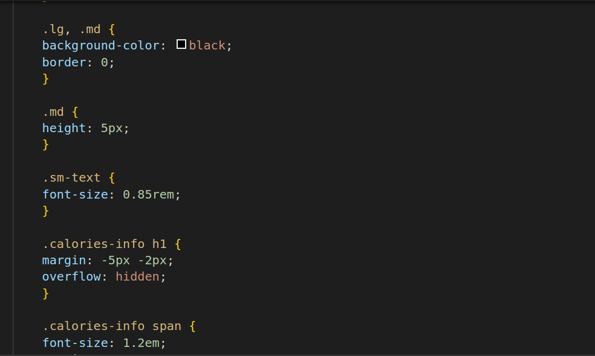
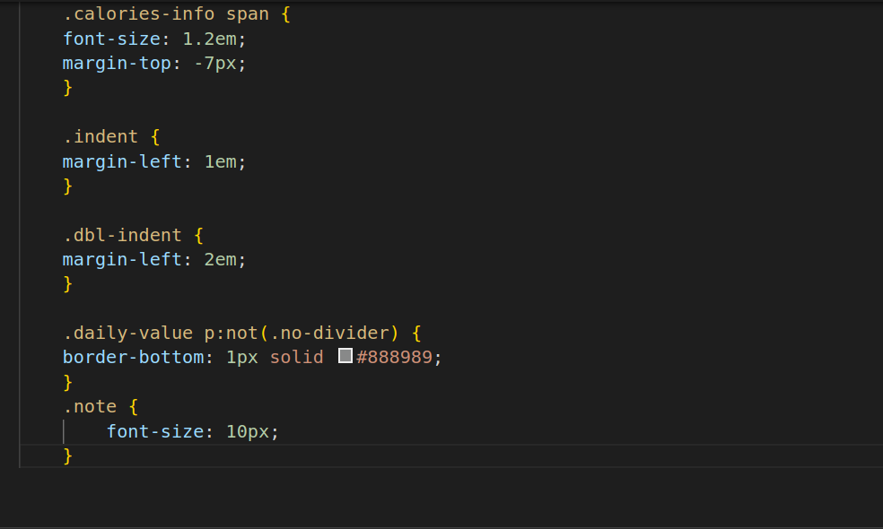

# Nutrition Label
1.
* The link element Links an external CSS stylesheet named "style.css" to apply styles to the HTML content.
* h1 This is a level 1 heading element. It displays the title "Nutrition Facts" and applies bold styling.
* div element with the class "divider" is used to create a horizontal line as a visual separator.
* p A paragraph element that provides information about the number of servings per container.
*lg : Another div element with the class "divider lg" is used to create a larger horizontal line.
* calorie-info This div element with the class "calories-info" is used to group and style content related to calorie information.
* bold sm-text:A paragraph with the classes "bold" and "sm-text" that provides information about the amount per serving.
2.
*The divider md: Another div element with the class "divider md" is used to create a medium-sized horizontal line.
* div class="daily-value sm-text: This div element with the class daily-value" groups and styles content related to daily nutritional values.
* p : A paragraph with the classes "right," "bold," and "no-divider" that provides information about the daily value percentage.
* Other p elements within this div provide details about various nutritional components and their percentages.

3.
* box-sizing: border-box:This property ensures that the total width and height of an element include padding and border, not just the content. It's a helpful way to handle box sizing in layouts.
* html { font-size: 16px; }Sets the base font size for the entire HTML document to 16 pixels. This size is used as a reference for relative font sizes defined elsewhere.
* body { font-family: 'Open Sans', sans-serif; }Specifies the font family for the text within the body element. In this case, it uses the 'Open Sans' font and falls back to a generic sans-serif font if 'Open Sans' is unavailable.
*.label:This is a class selector for elements with the class "label," which is used to style a container with a border, width, margin, and padding.
* header h1:Targets the h1 element within the header and applies styling to center-align the text, adjust margins, and set letter spacing.

4.
* p:Targets all p elements on the page and removes the default margin.
*.divider :Styles elements with the class "divider," which adds a bottom border, margin, and clears the right side to ensure elements don't wrap around it.
* .bold :Styles elements with the class "bold" to make the text bold by setting the font-weight property to 800 (a bold font weight).
* .right:Styles elements with the class "right" to make them float to the right.
* .lg :Styles elements with the class "lg" to have a height of 10 pixels and a black background color.
5.
* lg, .md :Applies styles to elements with both the classes "lg" and "md." It sets a black background and removes borders for elements with these classes.
* .md :Styles elements with the class "md" to have a height of 5 pixels.
* .sm-text :Styles elements with the class "sm-text" to reduce the font size to 0.85rem (85% of the default font size).
* .calories-info h1 :Targets the h1 element within elements with the class "calories-info" and applies styling to adjust margins and handle text overflow

6.
* calories-info span:Styles span elements within elements with the class "calories-info" to increase the font size and adjust the margin to overlap with the text.
* .indent :Styles elements with the class "indent" to add left margin space (1em) to create an indented effect.
* .dbl-indent:Styles elements with the class "dbl-indent" to add even more left margin space (2em) for a double-indented effect.
* .daily-value p:no-divider:Targets p elements within elements with the class "daily-value" that do not have the class "no-divider" and adds a bottom border to separate them.
* .note :Styles elements with the class "note" to set the font size to 10 pixels.

  # Hosted Link
  https://www.freecodecamp.org/learn/2022/responsive-web-design/learn-typography-by-building-a-nutrition-label/step-1?authuser=0
